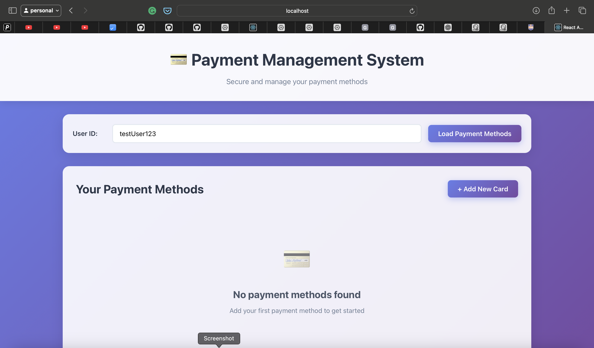
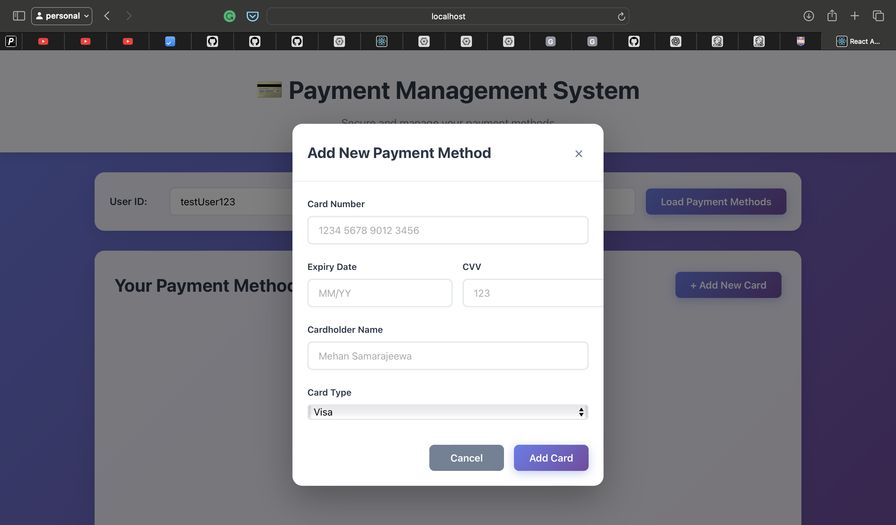
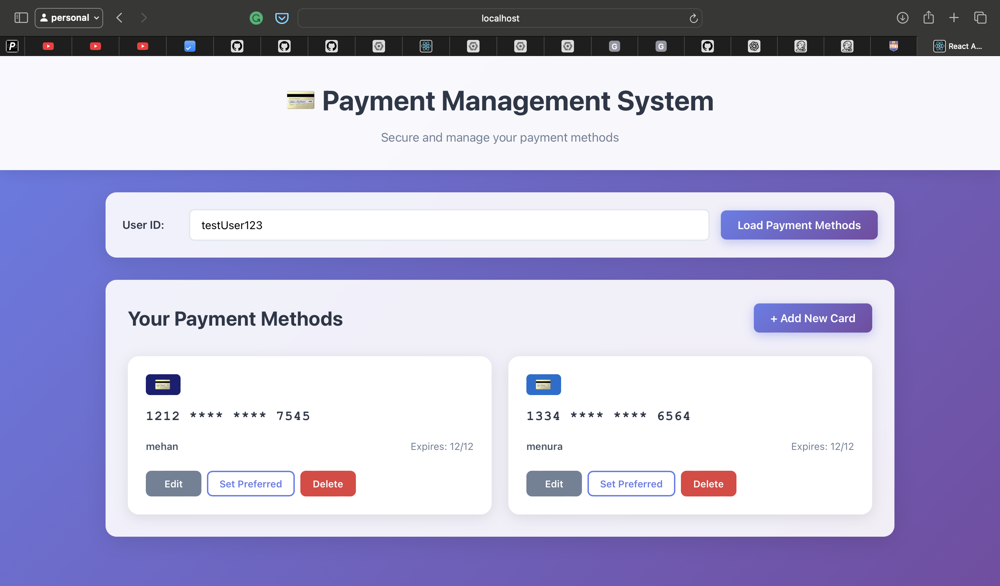

#  University Projects

This repository contains **my contributions** to the latest two group projects completed during my 2nd year of studies at **SLIIT**.  
Each project was developed collaboratively as part of academic coursework.

---
##  Textile Shop Management System

- **Tech Stack**: React, Tailwind CSS, Spring Boot  

###  My Role:
- Developed the payment management module (frontend & backend)  

📁 [My Contributions Repository](https://github.com/mehan02/payment-management-System)

---
### 👤 Payment management system
  

  
  

##  TrueFit: Virtual Wardrobe Platform

- **Tech Stack**: React, Vite, TypeScript, Tailwind CSS, Spring Boot, Maven, Python  
- **Project Management Tools**: Jira

###  My Role:
- Implemented the frontend login page  
- Developed user image upload functionality (frontend & backend)  
- Built user profile management module (frontend & backend)  
- Created user dimension input feature  

📁 [My Contributions Repository](https://github.com/mehan02/SE-Project-Contribution-Repo)

---

